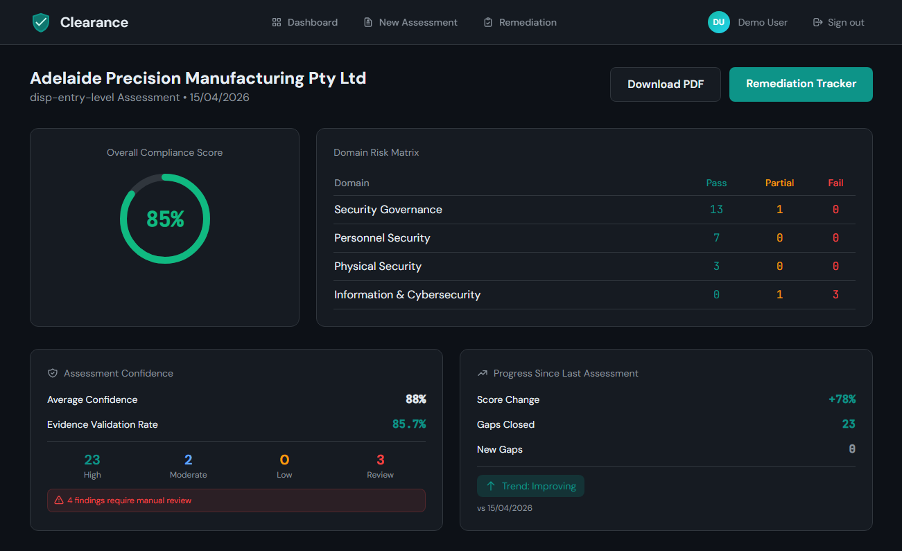
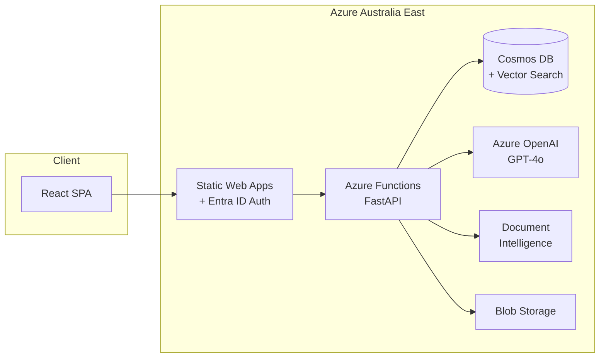

# Clearance

> AI-powered DISP compliance assessment for Australian defence SMEs

[](https://clearance.azurestaticapps.net)
[](https://github.com/YOUR_USERNAME/clearance/actions)
[](https://azure.microsoft.com)
[](LICENSE)

<!-- Replace with actual screenshot -->


---

## The Problem

Australian SMEs spend **$5,000–$20,000** on consultants for DISP compliance assessments. They wait **weeks** for a static PDF. Most can't afford to compete for $368B in AUKUS defence contracts.

## The Solution

Clearance delivers the same assessment quality in **minutes**.

| Step | Action |
|------|--------|
| **1. Upload** | Drop your security documentation (PDF) |
| **2. Analyse** | AI evaluates against 36 DISP + Essential Eight requirements |
| **3. Track** | Manage remediation with Kanban workflow |
| **4. Export** | Download professional reports indistinguishable from consultant output |

---

## Architecture



### Technology Decisions

| Layer | Choice | Why |
|-------|--------|-----|
| **Frontend** | React + Vite + TailwindCSS | Fast builds, modern DX, utility-first styling |
| **Backend** | FastAPI on Azure Functions | Python AI ecosystem, consumption billing, familiar patterns |
| **AI Analysis** | Azure OpenAI GPT-4o | Enterprise SLA, Australia East data residency |
| **Vector Search** | Cosmos DB native | $0 fixed cost vs $73/mo AI Search — [ADR-001](docs/decisions/001-cosmos-vector-search.md) |
| **Auth** | Microsoft Entra ID | Enterprise SSO, zero friction for M365 users — [ADR-005](docs/decisions/005-entra-id-authentication.md) |
| **Region** | Australia East only | Data sovereignty for defence SMEs — [ADR-003](docs/decisions/003-data-sovereignty.md) |

### Cost Architecture

**$0 fixed monthly costs.** All services consumption-based:

| Service | Cost Model | Per Assessment |
|---------|------------|----------------|
| Azure OpenAI | Per token | ~$0.40 |
| Cosmos DB | Per RU | ~$0.01 |
| Document Intelligence | Free tier (500 pages/mo) | $0.00 |
| Functions | 1M free executions/mo | $0.00 |
| **Total** | | **~$0.50** |

See [ADR-002: Consumption Tier Strategy](docs/decisions/002-consumption-tier-strategy.md) for full rationale.

---

## Features

### Compliance Analysis
- **36 requirements** across DISP Entry Level + ASD Essential Eight
- **Semantic search** matches evidence even when wording differs
- **Citation tracking** with exact page references
- **Risk scoring** with prioritized remediation recommendations

### Report Generation
- **Professional PDF export** matching consultant quality
- **Executive summary** auto-generated by GPT-4o
- **Domain breakdown** with pass/partial/fail status
- **Remediation actions** specific and actionable

### Workflow Management
- **Kanban tracker** for remediation progress
- **Gap status updates** reflected in real-time scores
- **Assessment history** with comparison over time

---

## Local Development

### Prerequisites

- Node.js 20+
- Python 3.11+
- Azure CLI
- Azure Functions Core Tools v4

### Setup

```bash
# Clone repository
git clone https://github.com/YOUR_USERNAME/clearance.git
cd clearance

# Frontend
cd frontend
npm install
npm run dev

# Backend (new terminal)
cd backend
python -m venv .venv
.venv\Scripts\activate  # Windows
pip install -r requirements.txt
func start
```

### Environment Variables

Copy `.env.example` to `.env` and populate:

```bash
# Azure OpenAI
AZURE_OPENAI_ENDPOINT=https://clearance-openai-dev.openai.azure.com/
AZURE_OPENAI_KEY=your-key

# Cosmos DB
COSMOS_ENDPOINT=https://clearance-cosmos-dev.documents.azure.com:443/
COSMOS_KEY=your-key

# Document Intelligence
DOC_INTEL_ENDPOINT=https://clearance-docint-dev.cognitiveservices.azure.com/
DOC_INTEL_KEY=your-key

# Blob Storage
STORAGE_CONNECTION_STRING=your-connection-string
```

---

## API Documentation

| Endpoint | Method | Purpose |
|----------|--------|---------|
| `/health` | GET | Service health + dependencies |
| `/frameworks` | GET | Available compliance frameworks |
| `/upload` | POST | Upload PDF for analysis |
| `/analyse` | POST | Start compliance analysis |
| `/reports/{user_id}` | GET | List user's assessments |
| `/report/{report_id}` | GET | Full report detail |
| `/report/{id}/gap/{gap_id}` | PATCH | Update gap status |

Full API documentation: [docs/api/ENDPOINTS.md](docs/api/ENDPOINTS.md)

---

## Architecture Decisions

Key technical decisions documented with rationale:

| ADR | Decision | Impact |
|-----|----------|--------|
| [001](docs/decisions/001-cosmos-vector-search.md) | Cosmos DB over AI Search | Saved $876/year |
| [002](docs/decisions/002-consumption-tier-strategy.md) | Consumption tiers only | $0 fixed costs |
| [003](docs/decisions/003-data-sovereignty.md) | Australia East deployment | Data sovereignty compliance |
| [004](docs/decisions/004-fastapi-asgi-pattern.md) | FastAPI ASGI wrapper | Standard patterns, fast testing |
| [005](docs/decisions/005-entra-id-authentication.md) | Entra ID auth | Enterprise SSO, zero friction |

---

## Project Structure

```
clearance/
├── frontend/              # React + Vite application
│   ├── src/
│   │   ├── components/    # Reusable UI components
│   │   ├── pages/         # Route pages
│   │   ├── services/      # API client
│   │   └── hooks/         # Custom React hooks
│   └── public/
├── backend/               # FastAPI on Azure Functions
│   ├── api/
│   │   ├── routers/       # Endpoint handlers
│   │   ├── services/      # Business logic
│   │   └── models/        # Pydantic schemas
│   └── function_app.py    # Azure Functions entry
├── src/frameworks/        # DISP/E8 requirement JSONs
├── docs/
│   ├── decisions/         # Architecture Decision Records
│   └── architecture/      # System design documentation
├── tests/                 # pytest test suite
└── scripts/               # Deployment utilities
```

---

## Testing

```bash
cd backend
pytest -v

# With coverage
pytest --cov=api --cov-report=html
```

---

## Deployment

Automated via GitHub Actions:

- **CI**: Runs on every push — linting, type checking, tests
- **Deploy**: Triggers on merge to main — deploys to Azure

Manual deployment:

```bash
# Frontend
cd frontend
npm run build
swa deploy ./dist --env production

# Backend
cd backend
func azure functionapp publish clearance-api-dev
```

---

## License

MIT — see [LICENSE](LICENSE) for details.

---

## Author

**Junaid Abrar**

Masters in Computing and Innovation — University of Adelaide

[](https://linkedin.com/in/YOUR_PROFILE)
[](https://github.com/YOUR_USERNAME)

**Certifications:** AZ-900 (Azure Fundamentals) | AZ-204 (In Progress)

---

<p align="center">
  <sub>Built with Azure AI services in Australia East</sub>
</p>
